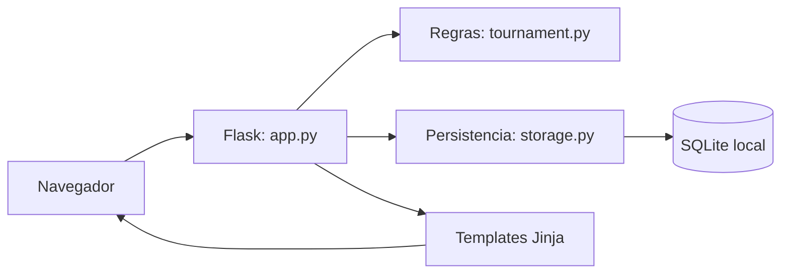

# Plano técnico do DOIS

Derivado de [spec.md](spec.md); entrega da [issue #3](https://github.com/miyamotoyoji/projeto-rafa-e-daniel/issues/3). Base de código examinada: `6240c95`. Documento retrospectivo do desenho existente, com próximos passos separados do que já funciona.

## Arquitetura e organização

Monólito Flask com regras de domínio independentes do framework. O código-fonte na raiz (`app.py`, `tournament.py`, `storage.py`, `iniciar.py`), junto de `templates/` e `static/`, é o equivalente a `/src` permitido pelo enunciado (§9.1). Não mover arquivos apenas para mudar a aparência da árvore e quebrar comandos de execução.

| Componente | Responsabilidade | Requisitos |
| --- | --- | --- |
| `tournament.create/register/remove_player` | Capacidade, inscrição e lista de jogadores | RF01–RF05 |
| `tournament.draw` | Duplas, grupos, confrontos e fechamento da inscrição | RF06–RF08 |
| `tournament.set_score/standings/advance` | Resultado, classificação e transições | RF09–RF15 |
| `app.create_app` e templates | Rotas, páginas, validação e controles administrativos | RF16–RF20, RNF03–RNF08 |
| `storage` | Transações e persistência do agregado | RNF01–RNF02 |
| `iniciar.py` | Ambiente virtual, dependências, configuração e servidor local | Execução reprodutível |

## Modelo físico e consistência

SQLite contém `tournament(id=1, data JSON em TEXT)`, `organizer(id=1, username, password_hash, version)` e `login_attempt(address, failures, started)`. Identificadores únicos de campeonato/organizador são garantidos pelo esquema. Os relacionamentos internos do JSON dependem das regras Python, não de chaves estrangeiras.

Toda mutação do campeonato ocorre em `BEGIN IMMEDIATE`: ler, validar, alterar e salvar na mesma transação. Erro causa rollback. Isso serializa inscrições e evita ocupar duas vezes a última vaga. O arquivo SQLite precisa de armazenamento persistente e permanece em `instance/`, ignorado pelo Git.

Consulta pública: navegador → rota GET → leitura SQLite → classificação em memória → template. Mutação: formulário POST → CSRF → autorização quando aplicável → transação → regra → persistência → redirecionamento/mensagem. A inscrição inválida retorna HTTP 400; ações administrativas inválidas retornam redirecionamento com mensagem e dados preservados.

## Decisões registradas

1. [ADR 001](docs/adr/001-monolito-flask.md): Flask, HTML no servidor e separação de responsabilidades.
2. [ADR 002](docs/adr/002-sqlite-agregado.md): SQLite e agregado JSON de campeonato único.
3. [ADR 003](docs/adr/003-acesso-organizador.md): inscrição sem conta e autenticação restrita ao organizador.
4. [ADR 004](docs/adr/004-sem-ia-no-produto.md): algoritmo explícito, sem IA nem API Riot no produto.

## Etapas e dependências

| Etapa | Entrega | Dependência | Estado |
| --- | --- | --- | --- |
| P01 | Delimitar domínio, perfis e regras | Tema aprovado | Código definido; formalização EARS nesta revisão |
| P02 | Implementar regras e persistência | P01 | Implementada |
| P03 | Rotas, autenticação e interface | P02 | Implementada |
| P04 | Testes de regras/HTTP e conferência visual | P03 | Executados; lacunas em docs/TESTES.md |
| P05 | Spec, plano, tarefas, ADR, SSDLC e revisão | P01–P04 | Preparação da issue #3 |
| P06 | Revisão por outro integrante e correções | P05 | Pendente; não equivale à revisão do agente |
| P07 | Ensaio, evidências pessoais e entrega | P06 | Pendente |

## Processo de desenvolvimento e SSDLC

Para cada mudança relevante: abrir issue com prioridade, responsável e aceite; criar branch; atualizar requisito/ADR quando necessário; implementar; validar os critérios afetados; abrir PR com `Refs #numero` ou `Closes #numero`; pedir revisão a outro integrante; corrigir; somente então integrar e fechar issue com evidência.

As tarefas atômicas estão em [tasks.md](tasks.md). A orientação ao agente está em [.specify/README.md](.specify/README.md). Os commits diretos anteriores são fatos do histórico, não serão reescritos para simular o processo. A issue #3 documenta o início da adequação; não comprova participação semanal anterior.

Antes de cada entrega, comparar requisito → função → teste, conferir páginas modificadas e procurar links/documentos desatualizados. Revisões usam quatro dimensões em [docs/review](docs/review/README.md). Segurança e SSDLC: [docs/SEGURANCA.md](docs/SEGURANCA.md).

## Execução, limites e operação

Python 3.11+, dependências fixadas em `requirements.txt`, inicialização por `python iniciar.py`; o site atende no próprio computador, porta 5173. Para publicação futura serão necessários servidor Python, HTTPS, armazenamento persistente, segredo de sessão e revisão de configuração de proxy. Não há publicação automática nem suporte por GitHub Pages.

O tamanho máximo de 32 jogadores limita o custo das regras, mas não há benchmark de carga. Leitura recalcula classificação, verificação de senha mantém uma transação aberta e não existe trilha de auditoria dos placares. Esses limites constam como achados, não como problemas resolvidos.

## Proposta de divisão — aguarda confirmação dos dois

Rafael: validar inscrição, privacidade e experiência no celular; manter spec e casos de uso públicos. Daniel: validar sorteio, desempates, avanço e recuperação do banco; revisar ADRs e domínio. Cada um abre suas próprias issues/branches/PRs para alterações efetivas e revisa entregas do colega. Ambos ensaiam o fluxo completo e explicam decisões. Essa é uma proposta futura, não atribuição de autoria ao código produzido com o agente.
