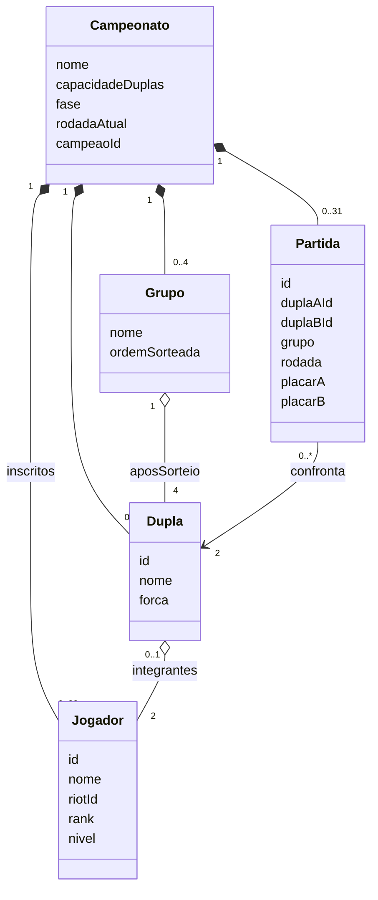
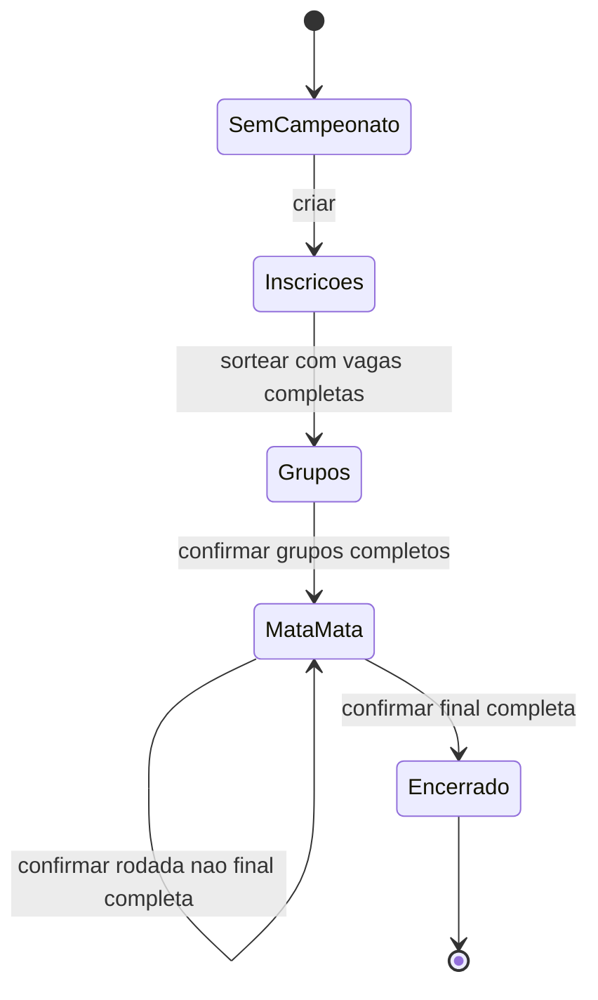

# DOIS — especificação do sistema

Fonte de verdade funcional do projeto de Rafael e Daniel, Modelagem de Software, 2026-2, turma 04G. Revisão de 09/10/2026, vinculada à [issue #3](https://github.com/miyamotoyoji/projeto-rafa-e-daniel/issues/3). Esta especificação consolida retrospectivamente o comportamento existente; não representa documentação escrita antes da implementação.

## 1. Problema, objetivo e escopo

Organizadores de campeonatos amadores precisam distribuir jogadores de níveis diferentes em duplas e manter classificação e chaveamento sem erros de cálculo. Participantes precisam saber sua dupla, seus confrontos e os resultados sem depender de mensagens dispersas.

O DOIS organiza campeonatos de Valorant 2 contra 2, com inscrições individuais, duplas fixas, grupos e mata-mata. Tema aprovado pelo professor, conforme confirmação de Rafael em 09/10/2026; não foi fornecida a data original da aprovação. As partidas acontecem no jogo, e o organizador informa os placares.

| Duplas | Jogadores | Grupos de quatro | Classificados | Rodadas eliminatórias | Partidas totais |
| --- | --- | --- | --- | --- | --- |
| 8 | 16 | 2 | 4 | Semifinais e final | 15 |
| 16 | 32 | 4 | 8 | Quartas, semifinais e final | 31 |

Fora do escopo: outros jogos, W.O., check-in, disputas com evidências, chat, calendário, terceiro lugar, prêmio, transmissão, múltiplos campeonatos por instalação, reinício pela interface, múltiplas credenciais de organizador e consulta à Riot. Os exemplos de W.O. e disputas no enunciado são inspirações de tema, não restrições obrigatórias da seção 6. Hospedagem pública é uma possível etapa posterior.

## 2. Personas e perfis

Personas de projeto, ainda não validadas por entrevistas; não representam pessoas pesquisadas.

| Persona | Objetivo e dificuldade | Permissões e interesse |
| --- | --- | --- |
| Participante da comunidade | Inscrever-se rapidamente e consultar confrontos pelo celular; não quer criar outra conta | Informar nome, Riot ID e rank; consultar nomes, ranks, duplas e resultados; não alterar resultados nem ver os Riot IDs alheios |
| Organizador voluntário | Conferir inscrições, equilibrar duplas e controlar fases sem planilhas manuais | Autenticar-se; criar campeonato; consultar Riot IDs; remover inscrição antes do sorteio; sortear; corrigir a fase atual; confirmar avanços |

Visitantes compartilham as permissões públicas do participante. A ausência de conta de jogador é intencional; os dois perfis possuem permissões diferentes, mas só o organizador se autentica.

## 3. Regras de negócio

| ID | Regra |
| --- | --- |
| RN01 | Uma instalação mantém um campeonato de 8 ou 16 duplas, respectivamente 16 ou 32 jogadores. O nome tem 3 a 70 caracteres após remoção de espaços nas extremidades. |
| RN02 | Nome do jogador: 2 a 40 caracteres; Riot ID: parte antes de # com 3 a 16 caracteres, sem # ou controles ASCII, e tag com 3 a 5 letras ASCII ou números; rank em RN04. Espaços externos são removidos. Não comprova existência ou posse da conta Riot. |
| RN03 | Riot IDs são únicos sem distinção entre maiúsculas e minúsculas. Inscrições e remoções só acontecem antes do sorteio; não há inscrição em espera. |
| RN04 | Ferro=1, Bronze=2, Prata=3, Ouro=4, Platina=5, Diamante=6, Ascendente=7, Imortal=8, Radiante=9. Rank é autodeclarado, sem divisões. |
| RN05 | Exigir todas as vagas; embaralhar jogadores, ordenar por nível e parear menor com maior, segundo menor com segundo maior, sucessivamente. O embaralhamento desempata níveis iguais. Cada pessoa integra uma única dupla fixa. Não há garantia de igualdade de habilidade. |
| RN06 | Embaralhar duplas em grupos de quatro; todos enfrentam todos uma vez: seis partidas por grupo, três por dupla. |
| RN07 | Vitória vale 3 pontos, derrota 0. Desempate: pontos, saldo de rounds, rounds feitos e ordem sorteada no grupo. |
| RN08 | Placar: dois inteiros entre 0 e 99, diferentes. As regras da sala são combinadas pelo organizador; não se impõe o formato oficial ranqueado. |
| RN09 | Corrigir somente grupos ainda abertos ou a rodada atual do mata-mata. Recalcular classificação com o resultado corrigido, sem acumular a versão anterior. |
| RN10 | Somente avançar quando todos os confrontos da fase/rodada tiverem placar. Duas duplas de cada grupo avançam. |
| RN11 | 8 duplas: A1 × B2 e B1 × A2. 16 duplas: A1 × B2, C1 × D2, B1 × A2 e D1 × C2; confrontos adjacentes alimentam a rodada seguinte. Mesmo grupo só se reencontra na final. |
| RN12 | Confirmação da final registra uma única dupla campeã e encerra o campeonato. Resultados de fases anteriores ficam bloqueados. |
| RN13 | Nomes, ranks e resultados são públicos; Riot IDs são restritos à organização. |

## 4. Requisitos em EARS

Convenção em português baseada no [guia do autor de EARS, Alistair Mavin](https://alistairmavin.com/ears/): **Quando** indica evento; **Enquanto** indica estado; **Se … então** descreve situação indesejada; **O DOIS deverá** expressa obrigação contínua. Combinações mantêm estado antes de evento. Não se exige usar todos os padrões quando não há funcionalidade opcional correspondente.

| ID | Padrão | Requisito verificável |
| --- | --- | --- |
| RF01 | Complexo | Enquanto não houver campeonato e o organizador estiver autenticado, quando ele enviar nome e capacidade válidos por RN01, o DOIS deverá criar um campeonato com inscrições abertas. |
| RF02 | Indesejado | Se for solicitada a criação de outro campeonato na mesma instalação, então o DOIS deverá recusar a operação e preservar os dados existentes. |
| RF03 | Complexo | Enquanto as inscrições estiverem abertas e houver vaga, quando um participante enviar dados válidos por RN02–RN04, o DOIS deverá registrar sua inscrição. |
| RF04 | Indesejado | Se uma inscrição tiver dados inválidos, Riot ID duplicado, ausência de campeonato, lotação ou fase fechada, então o DOIS deverá recusá-la com mensagem explicativa, sem adicionar jogador. |
| RF05 | Complexo | Enquanto as inscrições estiverem abertas, quando o organizador solicitar a remoção de um jogador existente, o DOIS deverá removê-lo e liberar a vaga. |
| RF06 | Complexo | Enquanto as inscrições estiverem abertas e todas as vagas preenchidas, quando o organizador solicitar o sorteio, o DOIS deverá formar duplas conforme RN05. |
| RF07 | Evento | Quando concluir a formação das duplas, o DOIS deverá gerar grupos e confrontos conforme RN06 e entrar na fase de grupos. |
| RF08 | Indesejado | Se for solicitado sorteio com vagas abertas ou depois de um sorteio concluído, então o DOIS deverá recusar a operação sem modificar o campeonato. |
| RF09 | Complexo | Enquanto uma partida for editável por RN09, quando o organizador enviar um placar válido por RN08, o DOIS deverá salvar esse resultado substituindo eventual placar anterior. |
| RF10 | Indesejado | Se o placar for inválido, a partida não existir ou não for editável, então o DOIS deverá recusar a alteração e preservar os resultados. |
| RF11 | Evento | Quando for consultada a classificação de um grupo, o DOIS deverá calculá-la a partir dos placares registrados conforme RN07. |
| RF12 | Complexo | Enquanto os grupos estiverem completos, quando o organizador confirmar o avanço, o DOIS deverá classificar duas duplas por grupo e criar a primeira rodada eliminatória conforme RN10–RN11. |
| RF13 | Indesejado | Se houver partida sem resultado na fase ou rodada atual, então o DOIS deverá recusar o avanço e preservar a fase. |
| RF14 | Complexo | Enquanto uma rodada eliminatória não final estiver completa, quando o organizador confirmar seu avanço, o DOIS deverá gerar a próxima rodada com os vencedores de confrontos adjacentes. |
| RF15 | Complexo | Enquanto a final estiver completa, quando o organizador confirmar o encerramento, o DOIS deverá registrar sua dupla vencedora como campeã e encerrar o campeonato. |
| RF16 | Estado | Enquanto não houver campeonato, o DOIS deverá apresentar páginas públicas com estados vazios sem jogadores ou resultados inventados. |
| RF17 | Evento | Quando um visitante consultar início, duplas, grupos ou mata-mata, o DOIS deverá exibir os dados públicos disponíveis conforme RN13. |
| RF18 | Evento | Quando forem enviadas credenciais válidas de organizador em um formulário aceito e fora do bloqueio de tentativas, o DOIS deverá iniciar uma sessão de organização. |
| RF19 | Indesejado | Se uma pessoa sem sessão válida solicitar uma operação de organização, então o DOIS deverá negar a alteração do campeonato. |
| RF20 | Evento | Quando o organizador solicitar a saída, o DOIS deverá encerrar sua sessão. |
| RNF01 | Ubíquo | O DOIS deverá manter inscrições e resultados em armazenamento persistente recuperável entre execuções. |
| RNF02 | Indesejado | Se duas inscrições disputarem a última vaga simultaneamente, então o DOIS deverá confirmar no máximo uma delas. |
| RNF03 | Indesejado | Se um pedido POST não apresentar token CSRF válido, então o DOIS deverá rejeitá-lo antes de alterar os dados. |
| RNF04 | Ubíquo | O DOIS deverá armazenar a senha de organização como hash em vez de texto aberto. |
| RNF05 | Indesejado | Se um endereço atingir cinco falhas de login na janela de 15 minutos, então o DOIS deverá rejeitar novas tentativas até a expiração dessa janela. |
| RNF06 | Evento | Quando a credencial do organizador for substituída, o DOIS deverá invalidar as sessões baseadas na versão anterior. |
| RNF07 | Ubíquo | O DOIS deverá apresentar interface em português do Brasil legível entre 320 e 1440 pixels, com rolagem localizada quando tabelas e chaveamento excederem a largura disponível. |
| RNF08 | Ubíquo | O DOIS deverá renderizar dados fornecidos pelos participantes como texto, sem executar marcação HTML enviada em nomes. |

### Critérios de aceite observáveis

- CA01: 8 e 16 duplas completam inscrição → grupos → mata-mata → campeão, com 15 e 31 partidas, respectivamente.
- CA02: duplicata, lotação, sorteio incompleto, empate, placar fora do limite e avanço incompleto preservam o estado anterior.
- CA03: depois do sorteio, cada inscrito aparece uma vez nas duplas e cada dupla joga três confrontos no grupo.
- CA04: corrigir um placar atual altera os pontos; corrigir fase encerrada é recusado.
- CA05: visitante não administra nem recebe Riot IDs nas páginas públicas; organizador autenticado consegue operar o campeonato.
- CA06: reiniciar a aplicação mantém dados; dois pedidos pela última vaga não criam jogador extra.
- CA07: formulários inválidos por CSRF são rejeitados, texto HTML é escapado e troca de credencial invalida sessão.
- CA08: páginas funcionam em celular e computador; controles administrativos não dependem de encolher a página inteira.

Evidência automatizada e suas lacunas, inclusive combinações ainda sem teste específico, estão em [docs/TESTES.md](docs/TESTES.md). Critério documentado não equivale a cobertura exaustiva.

## 5. Backlog do produto

| ID | História | Prioridade | Requisitos | Situação |
| --- | --- | --- | --- | --- |
| US01 | Como organizador, quero abrir o campeonato para receber inscrições com capacidade definida | P1 | RF01–RF02 | Implementada |
| US02 | Como participante, quero me inscrever sem conta para disputar uma vaga | P1 | RF03–RF04 | Implementada |
| US03 | Como organizador, quero remover inscrições antes do sorteio para corrigir a lista | P1 | RF05 | Implementada |
| US04 | Como organizador, quero duplas por nível e grupos automáticos para organizar confrontos | P1 | RF06–RF08 | Implementada |
| US05 | Como organizador, quero registrar resultados e avançar fases completas para definir o campeão | P1 | RF09–RF15 | Implementada |
| US06 | Como participante, quero acompanhar dupla, classificação e chaveamento pelo celular | P1 | RF16–RF17, RNF07 | Implementada |
| US07 | Como organizador, quero acesso restrito e dados persistentes para manter o campeonato íntegro | P1 | RF18–RF20, RNF01–RNF06, RNF08 | Implementada com limites registrados na revisão |
| US08 | Como equipe de estudo, queremos rastrear decisões, requisitos, testes e revisão para demonstrar o trabalho | P1 | Todos; enunciado §§7–9 | Documentação em revisão; fluxo colaborativo em adoção |

## 6. Casos de uso

### UC01 — Abrir campeonato

Ator: organizador. Pré-condição: autenticação válida e instalação sem campeonato. Fluxo: escolher nome e 8/16 duplas; enviar; sistema valida RN01, persiste e abre inscrições. Alternativas: nome/capacidade inválidos ou campeonato existente preservam o estado. Pós-condição: `registration`. Requisitos: RF01–RF02, RF19.

### UC02 — Inscrever participante

Ator: participante. Pré-condição: campeonato criado. Fluxo: abrir inscrição; informar nome, Riot ID e rank; enviar; receber confirmação e ver a lista pública. Alternativas: inválido/duplicado/lotado/fechado é recusado; formulário mantém valores para correção. Pós-condição de sucesso: jogador persistido. Requisitos: RF03–RF04, RNF01–RNF03.

### UC03 — Conferir e sortear

Ator: organizador. Pré-condição: `registration`. Fluxo: conferir lista; opcionalmente remover uma inscrição por UC03a; preencher vagas restantes; confirmar sorteio; sistema forma duplas, grupos e confrontos. Alternativa: vagas incompletas impedem sorteio; sorteio já realizado não se repete. Pós-condição: `groups` e inscrições encerradas. UC03a: remoção exige jogador existente; inscrição inexistente ou fase fechada é recusada. Requisitos: RF05–RF08.

### UC04 — Registrar/corrigir placar

Ator: organizador. Pré-condição: partida editável da fase atual. Fluxo: informar dois placares; salvar; sistema substitui o resultado e apresenta dados atualizados. Alternativas: empate, limite, campo não numérico, partida inexistente ou fase antiga são recusados. Pós-condição: resultado persistido. Requisitos: RF09–RF11.

### UC05 — Classificar e encerrar

Ator: organizador. Pré-condição: grupos ou mata-mata. Fluxo: completar os placares; confirmar avanço; sistema cria os confrontos seguintes ou declara o campeão ao confirmar a final. Repetir por rodada. Alternativa: confronto incompleto impede avanço. Pós-condição: próxima rodada ou `finished`. Requisitos: RF12–RF15.

### UC06 — Acompanhar campeonato

Ator: visitante/participante. Fluxo: abrir início, duplas, grupos ou mata-mata; consultar estado persistido; atualizar a página para obter mudanças. Alternativa: sem campeonato ou sem sorteio, apresentar estado vazio correspondente. Pós-condição: nenhuma mutação. Requisitos: RF16–RF17, RNF07.

### UC07 — Entrar e sair da organização

Ator: organizador. Pré-condição: credencial configurada localmente. Fluxo: enviar login; acessar controles; encerrar sessão. Alternativas: credencial inválida retorna erro; cinco falhas bloqueiam tentativas na janela de 15 minutos; sessão inválida redireciona GET e nega mutações. Requisitos: RF18–RF20, RNF03–RNF06.

## 7. Modelo de domínio textual

O diagrama é conceitual: o código utiliza dicionários e listas; ele não declara classes Python com esses nomes. O armazenamento físico está em plan.md e no ADR 002.

Invariantes: antes do sorteio não há duplas nem grupos; depois dele cada jogador pertence a exatamente uma dupla e cada dupla a um grupo. Partida de grupo tem `group` preenchido e `round=0`; eliminatória tem `group=None` e rodada positiva. Placar pendente é `None`; classificação é calculada, não uma entidade gravada separadamente. Campeão é nulo até o encerramento. Quantidades possíveis de grupos após sorteio são exatamente 2 ou 4.

## 8. Interface e rastreabilidade

Páginas: `/`, `/inscricao`, `/duplas`, `/grupos`, `/mata-mata`, `/organizador/entrar` e `/organizador`. Direção visual: fundo escuro, branco quente e vermelho pontual, títulos condensados, tabelas, linhas e placares claros. Evitar neon, vidro, cartões repetitivos, textos promocionais e informações fictícias. Animações respondem a ações.

Fontes complementares: [plano técnico](plan.md), [tarefas](tasks.md), [matriz requisito/código/teste](docs/TESTES.md), [conformidade acadêmica](docs/CONFORMIDADE.md). IDs não devem ser reciclados; alterações de comportamento atualizam spec, plano, tarefas e teste no mesmo PR.
